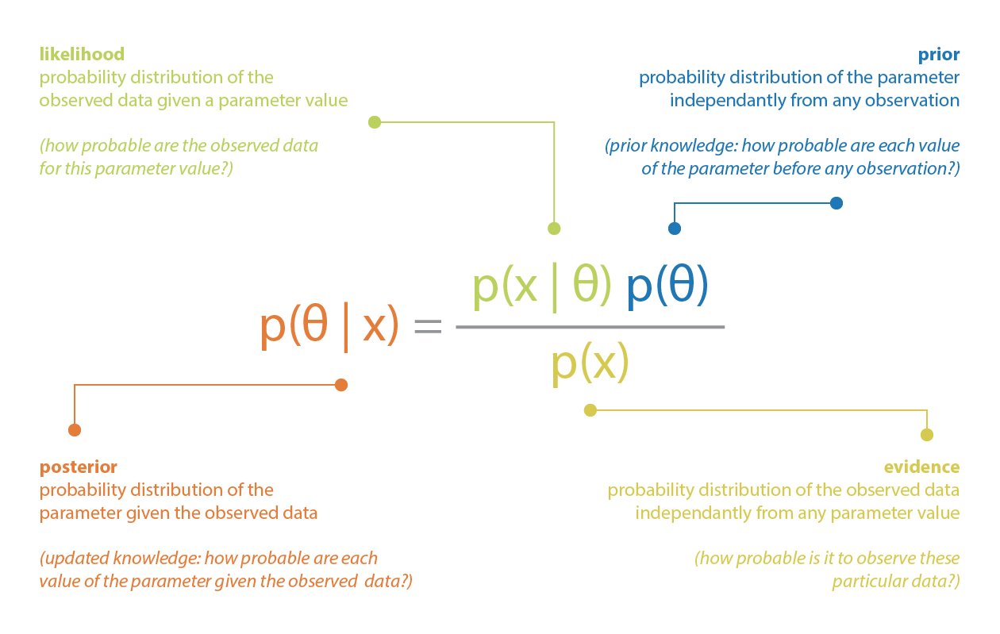
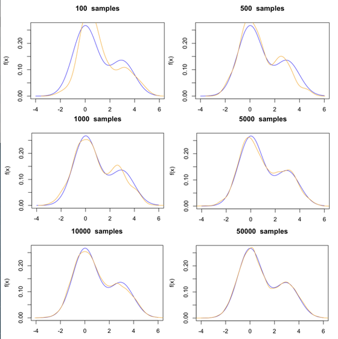
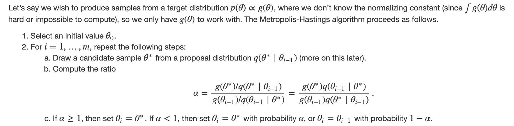
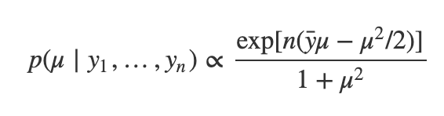
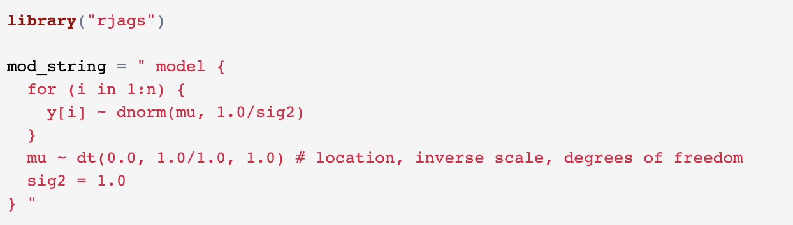
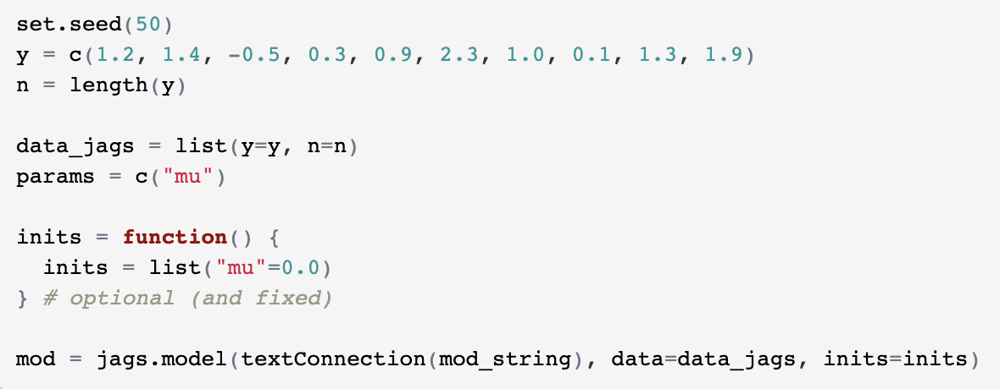
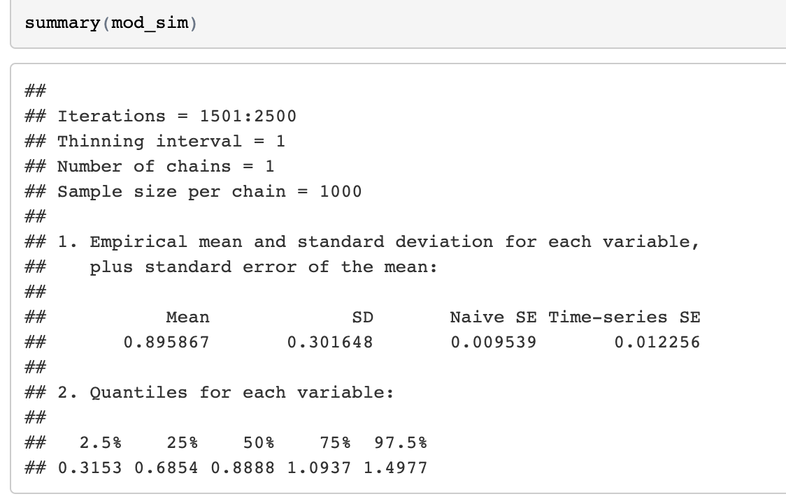
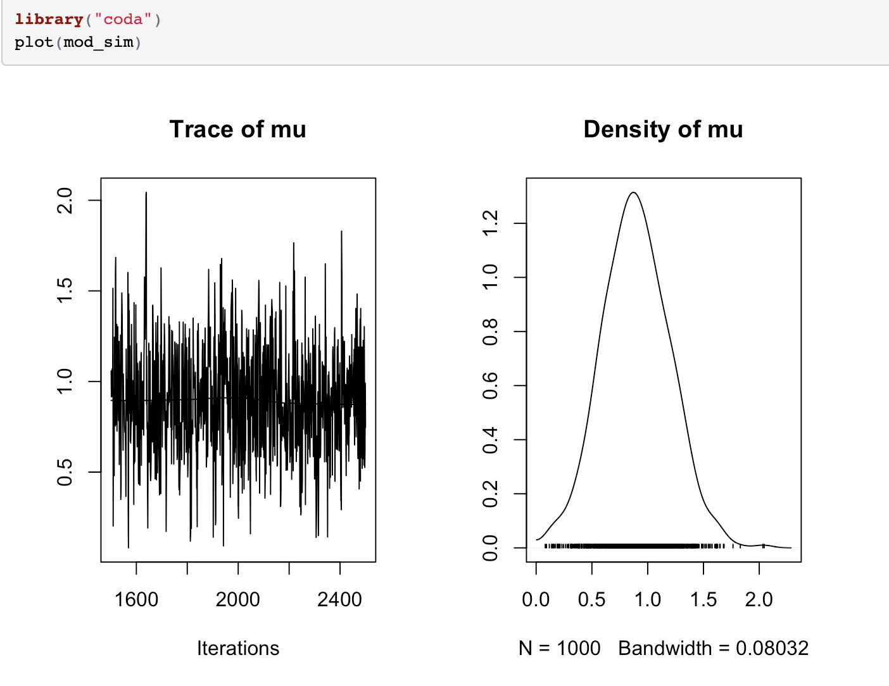

# Bayesian analysis by simulation

### The difference between Frequentist and Baysian:

Y ~ N(μ,σ2)

**Frequentist**: μ and σ2 are fixed
**Bayesian**: μ and σ2 are random variables

**Bayesian inference**: using Bayes Theroem to estimate the parameters of a probability distribution or statistical model

### Markov Chain Monte Carlo (MCMC)
**Classical Bayesian inference**: the conjugated prior should be chosen so that the resulting posterior density can be recognised as the density of a known distribution. 

**MCMC**: to approximate the posterior distribution of a parameter of interest by random sampling in a probabilistic space.

### Metropolis-Hastings sampling

Metropolis-Hastings sampling algorithm:

**Example**
In order to produce samples from the distribution:

yi | μ ~ N(μ,1)

μ ~ t (0, 1, 1)

After some transformation, We will have the target distribition P is propotional to Q:

where the left side is the target distribution P and the right side is Q. We can use Metropolis-Hastings sampling. The following code example used the popular simulation package JAGS (available both in R and Python)

### Code example 

#### Specify the model

#### Set up the model

#### Run and post processing

