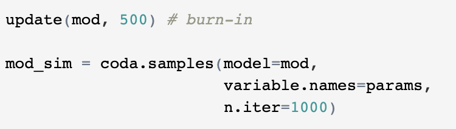

# Bayesian analysis by simulation

## Bayesian inference

Using Bayes Theroem to estimate the parameters of a probability distribution or statistical model

### Bayes Theroem 

### The difference between Frequentist and Baysian

Y ~ N(μ,σ2)

**Frequentist**: μ and σ2 are fixed

**Bayesian**: μ and σ2 are random variables

## Markov Chain Monte Carlo (MCMC)

**Classical Bayesian inference**

The evidence shown in above is also called the normalization factor, is sometimes difficult to be computed. In classical Bayesian inference, the conjugated prior should be chosen so that the resulting posterior density can be recognised as the density of a known distribution. 

**MCMC**

To approximate the posterior distribution of a parameter of interest by random sampling in a probabilistic space. The “Monte Carlo” part is due to the sampling purpose and the “Markov Chain” part describes the way we obtain these samples.

### Metropolis-Hastings sampling

**Metropolis-Hastings sampling algorithm**

**Example**

In order to produce samples from the distribution:

yi | μ ~ N(μ,1)

μ ~ t (0, 1, 1)

After some transformation, We will have the target distribition p is propotional to g:

where the left side is the target distribution p and the right side is g. We can use Metropolis-Hastings sampling. The following code example used the popular simulation package JAGS (available both in R and Python)

**Code example** 

#### Specify the model

#### Set up the model

#### Run and post processing

### Gibbs sampling

Gibbs sampling is a method of sampling with multiple parameters. The idea is that we can update multiple parameters by sampling just one parameter at a time, cycling through all parameters and repeating. To perform the update for one particular parameter, we substitute in the current values of all other parameters.

**Gibbs sampling algorithm**

### MCMC for linear regression

**Code example**

